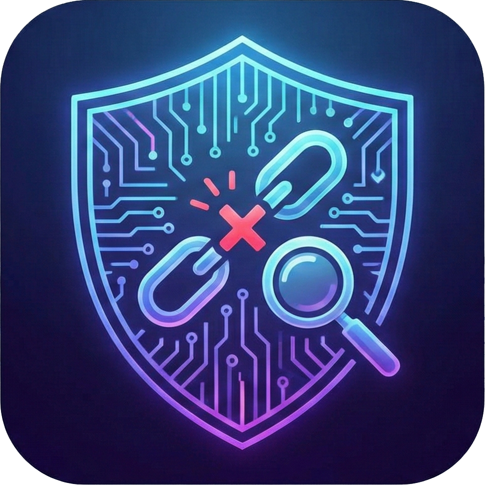

<<<<<<< HEAD
<div align="center">



# LinkGuard 🛡️

**A fast, explainable, multi-source URL threat scanner — know before you click.**

*ماسح روابط سريع وشفّاف متعدد المصادر — اعرف قبل أن تنقر.*

[](LICENSE)
[](#-contributing--المساهمة)
[](https://nextjs.org/)
[](https://www.typescriptlang.org/)
[](https://tailwindcss.com/)
[](https://vitest.dev/)
[](#-key-features--المميزات-الرئيسية)

[English](#overview) · [العربية](#نظرة-عامة) · [Quick Start](#-quick-start--البدء-السريع) · [Contributing](#-contributing--المساهمة)

</div>
=======
# **LinkGuard 🛡️**

> **كاشف الروابط الخبيثة — حماية متقدمة وشاملة ضد الروابط المشبوهة وهجمات التصيد الإلكتروني.**
>>>>>>> b566dfccd665edbf9a999a19a80224ba66ef21be

## **📌 جدول المحتويات**

<<<<<<< HEAD
## Overview

Short links, lookalike domains, and homograph tricks make it hard to tell a safe URL from a
malicious one **before** you click. Most checkers rely on a single blocklist and a fixed
threshold — one source goes down and the whole verdict is wrong.

**LinkGuard** takes a different approach. It resolves a link's full redirect chain, queries
several independent reputation sources **in parallel**, runs its own local heuristics, and
feeds everything into a **weighted scoring engine** that produces a 0–100 risk score **plus a
plain-language explanation of every piece of evidence** behind the verdict. Every API key is
optional — a missing or failing source simply lowers confidence instead of breaking the scan.

> [!NOTE]
> Scanning a link is not an endorsement of its content. Verdicts rely on third-party
> databases and may not be 100% accurate. Visiting any link is at your own risk.

---

## نظرة عامة

الروابط المختصرة والنطاقات المشابهة وخدع الأحرف المتشابهة (Homograph) تجعل من الصعب تمييز
الرابط الآمن من الخبيث **قبل** النقر عليه. معظم أدوات الفحص تعتمد على قائمة حظر واحدة وعتبة
ثابتة — يتعطل مصدر واحد فيصبح الحكم كله خاطئاً.

يتبع **LinkGuard** نهجاً مختلفاً: يتتبّع سلسلة التحويلات الكاملة للرابط، ويستعلم من عدة مصادر
سمعة مستقلة **بالتوازي**، ويشغّل تحليلاته المحلية، ثم يمرّر كل ذلك إلى **محرك تقييم موزون**
يُنتج درجة خطورة من 0 إلى 100 **مع شرح مبسّط لكل دليل** وراء الحكم. كل مفاتيح الـ API اختيارية —
أي مصدر غائب أو متعطّل يُخفّض الثقة فقط ولا يوقف الفحص.

---

## ✨ Key Features · المميزات الرئيسية

- 🔗 **Self-hosted redirect tracing** — follows up to 8 hops directly, guarded by an SSRF check that blocks internal-network targets. *(تتبّع التحويلات ذاتياً حتى 8 قفزات مع حماية SSRF.)*
- 🛰️ **Multiple sources, in parallel** — VirusTotal, Google Safe Browsing, URLhaus, PhishTank & AbuseIPDB; each key optional, any missing source only lowers confidence. *(مصادر متعددة بالتوازي، كل مفتاح اختياري.)*
- 🧠 **Deeper local analysis** — typosquatting, Punycode/homograph detection, subdomain impersonation, and an extended list of well-known brands. *(كشف التلاعب بالأحرف والانتحال محلياً.)*
- 🗓️ **Domain & certificate insight** — domain age via RDAP and live SSL certificate inspection, no API key required. *(عمر النطاق وفحص الشهادة بدون مفاتيح.)*
- 🔍 **"Why this verdict?" panel** — every contributing signal is listed with its source status (checked / key not set / unavailable). *(لوحة تشرح سبب كل حكم.)*
- 🕓 **Local scan history** — stored in `localStorage` with one-click re-scan. *(سجل فحوصات محلي مع إعادة فحص بضغطة.)*
- 👁️ **Safe preview** — a urlscan.io screenshot inside a mock browser frame, without ever visiting the link. *(معاينة آمنة دون زيارة الرابط.)*
- 📷 **QR scanner** — scan links straight from the camera. *(ماسح QR مباشر.)*
- 🌐 **Bilingual UI (AR/EN)** — full RTL support with a dark theme. *(واجهة ثنائية اللغة بدعم RTL.)*
- 📶 **Live `/status` page** — real-time health and response time for every external source. *(صفحة حالة حية لكل مصدر.)*
- 📲 **Installable PWA** — add LinkGuard to your home screen and run it like a native app. *(قابل للتثبيت كتطبيق PWA.)*

---

## 🛠️ Tech Stack · التقنيات المستخدمة

| Layer | Technology |
| :--- | :--- |
| **Framework** | [Next.js 14](https://nextjs.org/) (App Router) — full-stack UI + API routes |
| **Language** | [TypeScript 5](https://www.typescriptlang.org/) |
| **Styling** | [Tailwind CSS 3](https://tailwindcss.com/) + [framer-motion](https://www.framer.com/motion/) |
| **Icons / QR** | [lucide-react](https://lucide.dev/) · [html5-qrcode](https://github.com/mebjas/html5-qrcode) |
| **Domain parsing** | [tldts](https://github.com/remusao/tldts) |
| **Testing** | [Vitest](https://vitest.dev/) + `@vitest/coverage-v8`, CI via GitHub Actions |
| **Threat sources** | VirusTotal · urlscan.io · Google Safe Browsing · URLhaus · PhishTank · AbuseIPDB · RDAP *(all free tiers)* |

---

## 🚀 Quick Start · البدء السريع

### Prerequisites · المتطلبات المسبقة

- **Node.js** `18+` (LTS recommended)
- **npm** (ships with Node) — or your preferred package manager

> All threat-intelligence API keys are **optional**. LinkGuard runs out of the box and degrades
> gracefully; add keys later to unlock more sources.
> *(جميع مفاتيح الـ API اختيارية — يعمل المشروع مباشرة، وأضف المفاتيح لاحقاً لتفعيل مزيد من المصادر.)*

### Installation · التثبيت

```bash
# 1) Clone the repository
git clone https://github.com/hamwimoustafa88-maker/LinkGuard.git
cd LinkGuard

# 2) Install dependencies
npm install

# 3) Set up environment variables (all keys optional)
cp .env.example .env.local
#  Windows (PowerShell): Copy-Item .env.example .env.local

# 4) Start the development server
npm run dev
```

Open **[http://localhost:3000](http://localhost:3000)** in your browser. 🎉

### Available Scripts · الأوامر المتاحة

```bash
npm run dev        # Start the development server (hot reload)
npm run build      # Create an optimized production build
npm run start      # Serve the production build
npm run lint       # Run ESLint
npm run typecheck  # Type-check with tsc --noEmit
npm test           # Run the Vitest test suite
npm run test:watch # Run tests in watch mode
```

---

## 🔑 Environment Variables · متغيرات البيئة

Copy [`.env.example`](.env.example) to `.env.local` and fill in **only the keys you want to
enable**. Any key left blank means that source is skipped — the scan still works, it just
reports lower confidence.

*انسخ `.env.example` إلى `.env.local` واملأ المفاتيح التي تريد تفعيلها فقط. أي مفتاح فارغ يعني
تخطّي مصدره — يستمر الفحص مع خفض الثقة فقط.*

| Variable | Source | Free tier |
| :--- | :--- | :--- |
| `VIRUSTOTAL_API_KEY` | [VirusTotal v3](https://www.virustotal.com/gui/join-us) | 4 req/min · 500/day |
| `URLSCAN_API_KEY` | [urlscan.io](https://urlscan.io/user/signup) | Limited public scans/day |
| `UNSHORTEN_API_KEY` | [unshorten.me](https://unshorten.me/api) | Fallback resolver only |
| `GOOGLE_SAFE_BROWSING_API_KEY` | [Google Safe Browsing v4](https://developers.google.com/safe-browsing/v4/get-started) | 10,000 lookups/day |
| `URLHAUS_AUTH_KEY` | [URLhaus (abuse.ch)](https://urlhaus.abuse.ch/api/) | Free auth key (account) |
| `PHISHTANK_APP_KEY` | [PhishTank](https://www.phishtank.com/api_register.php) | Free app key (registration often closed) |
| `ABUSEIPDB_API_KEY` | [AbuseIPDB](https://www.abuseipdb.com/register) | 1,000 checks/day |

> [!WARNING]
> Never commit `.env.local` or real API keys to version control. It is already covered by
> `.gitignore`. *(لا ترفع `.env.local` أو أي مفاتيح حقيقية إلى المستودع.)*

---

## 🤝 Contributing · المساهمة

Contributions are what make the open-source community amazing — **all PRs are welcome!** 💚

*المساهمات هي ما يجعل مجتمع المصادر المفتوحة رائعاً — نرحّب بكل طلبات الدمج!*

1. 🐛 **Found a bug or have an idea?** [Open an issue](https://github.com/hamwimoustafa88-maker/LinkGuard/issues) first to discuss it.
2. 🍴 **Fork** the repository.
3. 🌿 Create your branch: `git checkout -b feat/amazing-feature`
4. ✅ Make your changes and make sure checks pass: `npm run lint && npm run typecheck && npm test`
5. 💾 Commit: `git commit -m "feat: add amazing feature"`
6. 🚀 Push and **open a Pull Request** against `main`.

Please keep the bilingual (AR/EN) UX and the graceful-degradation contract intact — a new
source should never be able to break an existing scan.

---

## 📄 License · الترخيص

This project is licensed under the **MIT License** — see the [LICENSE](LICENSE) file for the
full text. You are free to use, modify, and distribute it, commercially or otherwise, with
attribution. Copyright © 2026 **Mustafa Al-Hamwi**.

*هذا المشروع مرخّص تحت **رخصة MIT** — راجع ملف [LICENSE](LICENSE) للنص الكامل. أنت حر في
استخدامه وتعديله وتوزيعه، تجارياً أو غير ذلك، مع الإشارة للمصدر. حقوق النشر © 2026 **مصطفى الحموي**.*

---

<div align="center">

**© 2026 Mustafa Al-Hamwi · مصطفى الحموي** — Built with 🛡️ for a safer web.

If LinkGuard helped you, consider giving it a ⭐ on GitHub!

</div>
=======
* [🚀 حول المشروع](#bookmark=id.tgiedgj2cz0p)  
* [✨ الميزات الرئيسية](#bookmark=id.yq2jut4o27kv)  
* [🛠️ التقنيات المستخدمة](#bookmark=id.c4otthl8a5ln)  
* [📂 الهيكل التنظيمي للمشروع](#bookmark=id.q7wrpaht6z4d)  
* [⚙️ الإعداد والتشغيل المحلي](#bookmark=id.xe398x933rhp)  
* [🔑 متغيرات البيئة (Environment Variables)](#bookmark=id.otvw8iopfgj0)  
* [🐳 التشغيل باستخدام Docker](#bookmark=id.uzhekngejw1)  
* [🧪 الاختبارات وضمان الجودة](#bookmark=id.q5wae4j9gf3y)  
* [📖 كيفية الاستخدام](#bookmark=id.uu8xch805389)  
* [🤝 المساهمة والتطوير (Contributing)](#bookmark=id.kq161kofh7vj)  
* [📄 الرخصة (License)](#bookmark=id.1w63cpgni790)  
* [⚠️ إخلاء مسؤولية](#bookmark=id.xev9w4uw5fsp)

## **🚀 حول المشروع**

**LinkGuard** تطبيق مبني باستخدام Next.js (TypeScript) يهدف إلى تعزيز الأمن السيبراني الشخصي والمؤسسي، من خلال توفير أداة سريعة وموثوقة لفحص الروابط (URLs) والتأكد من سلامتها قبل النقر عليها.

يقوم LinkGuard بتتبع الرابط وتحليله عبر عدة مصادر مستقلة بالتوازي، ثم يجمّع النتائج في محرك تقييم موزون (utils/scoring.ts) يُنتج درجة خطورة من 0 إلى 100 مع شرح مفصّل لسبب كل حكم — بدلاً من الاعتماد على مصدر واحد أو عتبة ثابتة.

## **✨ الميزات الرئيسية**

* **تتبع التحويلات ذاتياً:** يتبع المسار /api/resolve سلسلة التحويلات مباشرة (حتى 8 قفزات) لأي رابط مختصر، محمياً بفحص SSRF يمنع استهداف الشبكة الداخلية.  
* **مصادر فحص متعددة تعمل بالتوازي:** يدمج الفحص عبر VirusTotal، Google Safe Browsing، URLhaus، PhishTank، وAbuseIPDB — كل مفتاح API اختياري، وأي مصدر غائب أو متعطل لا يوقف الفحص، بل يُخفّض مستوى الثقة في النتيجة فقط.  
* **تحليل محلي أعمق:** كشف Typosquatting (تلاعب بالأحرف)، Punycode/Homograph، انتحال النطاقات الفرعية، وقائمة موسّعة من العلامات التجارية الشهيرة (utils/brandMatcher.ts).  
* **معلومات النطاق والشهادة:** استخراج عمر النطاق عبر RDAP وفحص شهادة SSL مباشرة دون الحاجة لأي مفتاح API خارجي.  
* **لوحة "لماذا هذا الحكم؟":** شرح دقيق لكل دليل ساهم في درجة الخطورة النهائية، مع بيان حالة كل مصدر (تم الفحص / مفتاح غير مضبوط / تعذر الفحص).  
* **معاينة آمنة:** التقاط لقطة شاشة عبر urlscan.io وعرضها داخل إطار متصفح وهمي بدون زيارة الرابط فعلياً.  
* **سجل فحوصات محلي:** حفظ التقرير في localStorage للرجوع إليه مع إمكانية إعادة الفحص بضغطة واحدة.  
* **واجهة ثنائية اللغة (عربي/إنجليزي):** تصميم حديث بالوضع الداكن (Dark Theme) بدعم RTL/LTR كامل.  
* **ماسح QR ومتابعة النظام:** فحص الروابط عبر الكاميرا مباشرة، ومتابعة حالة المصادر وزمن الاستجابة عبر صفحة /status.

## **🛠️ التقنيات المستخدمة**

* **الواجهة الأمامية والخلفية:** Next.js 14 (App Router)، React 18، TypeScript، Tailwind CSS، Framer Motion.  
* **الاختبارات والجودة:** Vitest (npm test) مع التكامل المستمر عبر GitHub Actions.  
* **المحركات والمصادر الأمنية:** VirusTotal API, urlscan.io, Google Safe Browsing, URLhaus, PhishTank, AbuseIPDB, RDAP/WHOIS Client.

## **📂 الهيكل التنظيمي للمشروع**

LinkGuard/  
├── app/                  \# مسارات وأصفحات Next.js App Router (API & Pages)  
│   ├── api/              \# نقاط النهاية لفحص الروابط وتتبع التحويلات  
│   └── status/           \# صفحة متابعة حالة الخدمة ومحركات الفحص  
├── components/           \# المكونات البرمجية للواجهة (UI Components)  
├── lib/                  \# المطبوعات والخدمات الخلفية (Server Utilities)  
├── utils/                \# الخوارزميات (Scoring system, Brand Matcher, etc.)  
│   ├── scoring.ts        \# محرك التقييم وحساب درجة الخطورة  
│   └── brandMatcher.ts   \# خوارزمية كشف انتحال العلامات التجارية  
├── public/               \# الملفات العامة وأيقونات PWA  
└── \_\_tests\_\_/            \# اختبارات الوحدات (Unit Tests)

## **⚙️ الإعداد والتشغيل المحلي**

### **المتطلبات الأساسية**

* **Node.js**: الإصدار 18.x أو أعلى.  
* **npm** أو **pnpm** أو **yarn**.

### **خطوات التشغيل**

1. **استنساخ المستودع:**  
   git clone https://github.com/hamwimoustafa88-maker/LinkGuard/tree/main
   
   cd LinkGuard

3. **تثبيت الاعتماديات:**  
   npm install

4. **إعداد متغيرات البيئة:**  
   قم بنسخ ملف البيئة التجريبي وإنشاء ملفك المحلي:  
   cp .env.example .env.local

5. **تشغيل الخادم المحلي:**  
   npm run dev

   افتح المتصفح على العنوان: http://localhost:3000

## **🔑 متغيرات البيئة (Environment Variables)**

جميع المفاتيح **اختيارية**. يشتغل التطبيق بآلية Fallback في حال عدم توفر المفاتيح:

\# Server Configuration  
PORT=3000

\# Optional Security Engines API Keys  
VIRUSTOTAL\_API\_KEY=your\_virustotal\_key  
GOOGLE\_SAFE\_BROWSING\_API\_KEY=your\_google\_key  
URLSCAN\_API\_KEY=your\_urlscan\_key  
ABUSEIPDB\_API\_KEY=your\_abuseipdb\_key

## **🐳 التشغيل باستخدام Docker**

يمكنك تشغيل المنصة في بيئة حاوية معزولة مباشرة:

\# بناء الصورة وتشغيل الحاوية  
docker build \-t linkguard .  
docker run \-p 3000:3000 \--env-file .env.local linkguard

أو استخدام **Docker Compose**:

docker-compose up \-d

## **🧪 الاختبارات وضمان الجودة**

تغطي الاختبارات خوارزميات التقييم وفحص الثغرات:

\# تشغيل جميع الاختبارات  
npm test

\# تشغيل الاختبارات مع تقرير التغطية  
npm run test:coverage

## **📖 كيفية الاستخدام**

1. قم بنسخ الرابط الذي تود فحصه (أو استخدم ماسح QR من التطبيق).  
2. الصق الرابط في الخانة المخصصة واضغط **"افحص الآن"**.  
3. انتظر لحظات للحصول على تقرير مفصّل يوضح درجة الخطورة وسبب الحكم مع معطيات النطاق وشهادة الأمان.

## **🤝 المساهمة والتطوير (Contributing)**

نرحب بكافة المساهمات لتطوير المنصة\! إذا كنت ترغب في إضافة محرك فحص جديد أو إصلاح ثغرة:

1. قم بـ **Fork** للمشروع.  
2. أنشئ فرع الميزة الجديدة (git checkout \-b feature/NewEngine).  
3. احفظ التغييرات (git commit \-m 'Add NewEngine integration').  
4. ادفع الفرع (git push origin feature/NewEngine).  
5. افتح **Pull Request** لمراجعته.

## **📄 الرخصة (License)**

هذا المشروع مفتوح المصدر ومتاح بموجب [**رخصة MIT**](http://docs.google.com/LICENSE).

## **⚠️ إخلاء مسؤولية**

كما هو موضح في الموقع:

> "فحص الروابط لا يعني الموافقة على محتواها. الدخول إلى أي رابط يكون على مسؤوليتك الخاصة. النتائج تعتمد على قواعد بيانات خارجية وقد لا تكون دقيقة بنسبة 100%."

**حقوق النشر:** © LinkGuard 2026 | مصطفى الحموي.
>>>>>>> b566dfccd665edbf9a999a19a80224ba66ef21be
