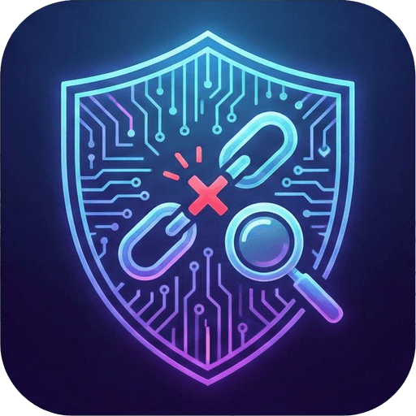

<div align="center">



# LinkGuard 🛡️

**A fast, explainable, multi-source URL threat scanner — know before you click.**

*ماسح روابط سريع وشفّاف متعدد المصادر — اعرف قبل أن تنقر.*

[](LICENSE)
[](#-contributing--المساهمة)
[](https://nextjs.org/)
[](https://www.typescriptlang.org/)
[](https://tailwindcss.com/)
[](https://vitest.dev/)
[](#-key-features--المميزات-الرئيسية)

[English](#overview) · [العربية](#نظرة-عامة) · [Quick Start](#-quick-start--البدء-السريع) · [Contributing](#-contributing--المساهمة)

</div>

---

## Overview

Short links, lookalike domains, and homograph tricks make it hard to tell a safe URL from a
malicious one **before** you click. Most checkers rely on a single blocklist and a fixed
threshold — one source goes down and the whole verdict is wrong.

**LinkGuard** takes a different approach. It resolves a link's full redirect chain, queries
several independent reputation sources **in parallel**, runs its own local heuristics, and
feeds everything into a **weighted scoring engine** that produces a 0–100 risk score **plus a
plain-language explanation of every piece of evidence** behind the verdict. Every API key is
optional — a missing or failing source simply lowers confidence instead of breaking the scan.

> [!NOTE]
> Scanning a link is not an endorsement of its content. Verdicts rely on third-party
> databases and may not be 100% accurate. Visiting any link is at your own risk.

---

## نظرة عامة

الروابط المختصرة والنطاقات المشابهة وخدع الأحرف المتشابهة (Homograph) تجعل من الصعب تمييز
الرابط الآمن من الخبيث **قبل** النقر عليه. معظم أدوات الفحص تعتمد على قائمة حظر واحدة وعتبة
ثابتة — يتعطل مصدر واحد فيصبح الحكم كله خاطئاً.

يتبع **LinkGuard** نهجاً مختلفاً: يتتبّع سلسلة التحويلات الكاملة للرابط، ويستعلم من عدة مصادر
سمعة مستقلة **بالتوازي**، ويشغّل تحليلاته المحلية، ثم يمرّر كل ذلك إلى **محرك تقييم موزون**
يُنتج درجة خطورة من 0 إلى 100 **مع شرح مبسّط لكل دليل** وراء الحكم. كل مفاتيح الـ API اختيارية —
أي مصدر غائب أو متعطّل يُخفّض الثقة فقط ولا يوقف الفحص.

---

## ✨ Key Features · المميزات الرئيسية

- 🔗 **Self-hosted redirect tracing** — follows up to 8 hops directly, guarded by an SSRF check that blocks internal-network targets. *(تتبّع التحويلات ذاتياً حتى 8 قفزات مع حماية SSRF.)*
- 🛰️ **Multiple sources, in parallel** — VirusTotal, Google Safe Browsing, URLhaus, PhishTank & AbuseIPDB; each key optional, any missing source only lowers confidence. *(مصادر متعددة بالتوازي، كل مفتاح اختياري.)*
- 🧠 **Deeper local analysis** — typosquatting, Punycode/homograph detection, subdomain impersonation, and an extended list of well-known brands. *(كشف التلاعب بالأحرف والانتحال محلياً.)*
- 🗓️ **Domain & certificate insight** — domain age via RDAP and live SSL certificate inspection, no API key required. *(عمر النطاق وفحص الشهادة بدون مفاتيح.)*
- 🔍 **"Why this verdict?" panel** — every contributing signal is listed with its source status (checked / key not set / unavailable). *(لوحة تشرح سبب كل حكم.)*
- 🕓 **Local scan history** — stored in `localStorage` with one-click re-scan. *(سجل فحوصات محلي مع إعادة فحص بضغطة.)*
- 👁️ **Safe preview** — a urlscan.io screenshot inside a mock browser frame, without ever visiting the link. *(معاينة آمنة دون زيارة الرابط.)*
- 📷 **QR scanner** — scan links straight from the camera. *(ماسح QR مباشر.)*
- 🌐 **Bilingual UI (AR/EN)** — full RTL support with a dark theme. *(واجهة ثنائية اللغة بدعم RTL.)*
- 📶 **Live `/status` page** — real-time health and response time for every external source. *(صفحة حالة حية لكل مصدر.)*
- 📲 **Installable PWA** — add LinkGuard to your home screen and run it like a native app. *(قابل للتثبيت كتطبيق PWA.)*

---

## 🛠️ Tech Stack · التقنيات المستخدمة

| Layer | Technology |
| :--- | :--- |
| **Framework** | [Next.js 16](https://nextjs.org/) (App Router, React 19) — full-stack UI + API routes |
| **Language** | [TypeScript 5](https://www.typescriptlang.org/) |
| **Styling** | [Tailwind CSS 4](https://tailwindcss.com/) + [framer-motion](https://www.framer.com/motion/) |
| **Icons / QR** | [lucide-react](https://lucide.dev/) · [html5-qrcode](https://github.com/mebjas/html5-qrcode) |
| **Domain parsing** | [tldts](https://github.com/remusao/tldts) |
| **Testing** | [Vitest](https://vitest.dev/) + `@vitest/coverage-v8`, CI via GitHub Actions |
| **Threat sources** | VirusTotal · urlscan.io · Google Safe Browsing · URLhaus · PhishTank · AbuseIPDB · RDAP *(all free tiers)* |

---

## 🏗️ Architecture · البنية

A scan runs through four stages, each one degrading independently rather than failing the
whole request:

1. **Resolve** ([`app/api/resolve`](app/api/resolve/route.ts)) — follows the redirect chain
   itself (up to 8 hops), validating every hop against [`lib/server/ssrfGuard.ts`](lib/server/ssrfGuard.ts)
   before it's fetched.
2. **Scan** ([`lib/scan.ts`](lib/scan.ts)) — fans out to VirusTotal, urlscan.io, Google Safe
   Browsing, the blocklist trio (URLhaus/PhishTank/AbuseIPDB), and domain/SSL intelligence
   **in parallel**; a slow or failing source only lowers confidence, never blocks the others.
3. **Analyze** ([`utils/brandMatcher.ts`](utils/brandMatcher.ts)) — local heuristics
   (typosquatting, homograph/Punycode, subdomain impersonation) run client-side, no network
   or API key required.
4. **Score** ([`utils/scoring.ts`](utils/scoring.ts)) — every signal becomes a weighted
   `EvidenceItem`; `aggregateVerdict()` sums the points into a 0–100 score, floors it for any
   authoritative match (e.g. a Safe Browsing hit), and derives a verdict + confidence level
   from how many sources actually responded.

Every external route shares [`lib/server/apiHelpers.ts`](lib/server/apiHelpers.ts) for
timeouts, per-route rate limiting, and result caching, so a new source only needs to implement
its own request/response mapping.

*تمرّ عملية الفحص بأربع مراحل، كل واحدة تتدهور بشكل مستقل دون إفشال الطلب كاملاً: **الحل**
(تتبّع التحويلات محلياً مع حماية SSRF)، **الفحص** (استعلام متوازٍ من كل المصادر الخارجية)،
**التحليل** (تحليلات محلية دون شبكة)، ثم **التقييم** (محرك موزون ينتج الدرجة والحكم ومستوى
الثقة).*

---

## 🚀 Quick Start · البدء السريع

### Prerequisites · المتطلبات المسبقة

- **Node.js** `20.9+` (LTS recommended)
- **npm** (ships with Node) — or your preferred package manager

> All threat-intelligence API keys are **optional**. LinkGuard runs out of the box and degrades
> gracefully; add keys later to unlock more sources.
> *(جميع مفاتيح الـ API اختيارية — يعمل المشروع مباشرة، وأضف المفاتيح لاحقاً لتفعيل مزيد من المصادر.)*

### Installation · التثبيت

```bash
# 1) Clone the repository
git clone https://github.com/hamwimoustafa88-maker/LinkGuard.git
cd LinkGuard

# 2) Install dependencies
npm install

# 3) Set up environment variables (all keys optional)
cp .env.example .env.local
#  Windows (PowerShell): Copy-Item .env.example .env.local

# 4) Start the development server
npm run dev
```

Open **[http://localhost:3000](http://localhost:3000)** in your browser. 🎉

### Available Scripts · الأوامر المتاحة

```bash
npm run dev        # Start the development server (hot reload)
npm run build      # Create an optimized production build
npm run start      # Serve the production build
npm run lint       # Run ESLint
npm run typecheck  # Type-check with tsc --noEmit
npm test           # Run the Vitest test suite
npm run test:watch # Run tests in watch mode
npm run test:coverage # Run tests with a coverage report
```

---

## 🔑 Environment Variables · متغيرات البيئة

Copy [`.env.example`](.env.example) to `.env.local` and fill in **only the keys you want to
enable**. Any key left blank means that source is skipped — the scan still works, it just
reports lower confidence.

*انسخ `.env.example` إلى `.env.local` واملأ المفاتيح التي تريد تفعيلها فقط. أي مفتاح فارغ يعني
تخطّي مصدره — يستمر الفحص مع خفض الثقة فقط.*

| Variable | Source | Free tier |
| :--- | :--- | :--- |
| `VIRUSTOTAL_API_KEY` | [VirusTotal v3](https://www.virustotal.com/gui/join-us) | 4 req/min · 500/day |
| `URLSCAN_API_KEY` | [urlscan.io](https://urlscan.io/user/signup) | Limited public scans/day |
| `UNSHORTEN_API_KEY` | [unshorten.me](https://unshorten.me/api) | Fallback resolver only |
| `GOOGLE_SAFE_BROWSING_API_KEY` | [Google Safe Browsing v4](https://developers.google.com/safe-browsing/v4/get-started) | 10,000 lookups/day |
| `URLHAUS_AUTH_KEY` | [URLhaus (abuse.ch)](https://urlhaus.abuse.ch/api/) | Free auth key (account) |
| `PHISHTANK_APP_KEY` | [PhishTank](https://www.phishtank.com/api_register.php) | Free app key (registration often closed) |
| `ABUSEIPDB_API_KEY` | [AbuseIPDB](https://www.abuseipdb.com/register) | 1,000 checks/day |
| `HEALTH_TOKEN` | *(self-chosen)* | — restricts the detail `/api/health` and `/status` reveal anonymously; see below |

`/status` is a deliberately public live-status page. Left unset (the default), it stays fully
public. If you'd rather not disclose *which* optional keys are configured, set `HEALTH_TOKEN`
and pass the same value in an `x-health-token` header to get full detail — anonymous requests
then only see an aggregate online/offline reading per source.

*`/status` صفحة حالة علنية عمداً. إن تُرك `HEALTH_TOKEN` فارغاً (الافتراضي) تبقى الصفحة علنية
بالكامل. لإخفاء تفاصيل المفاتيح المُفعّلة عن الزوار المجهولين، عيّن القيمة وأرسلها في ترويسة
`x-health-token` للحصول على التفاصيل الكاملة.*

> [!WARNING]
> Never commit `.env.local` or real API keys to version control. It is already covered by
> `.gitignore`. *(لا ترفع `.env.local` أو أي مفاتيح حقيقية إلى المستودع.)*

---

## 🤝 Contributing · المساهمة

Contributions are what make the open-source community amazing — **all PRs are welcome!** 💚

*المساهمات هي ما يجعل مجتمع المصادر المفتوحة رائعاً — نرحّب بكل طلبات الدمج!*

1. 🐛 **Found a bug or have an idea?** [Open an issue](https://github.com/hamwimoustafa88-maker/LinkGuard/issues) first to discuss it.
2. 🍴 **Fork** the repository.
3. 🌿 Create your branch: `git checkout -b feat/amazing-feature`
4. ✅ Make your changes and make sure checks pass: `npm run lint && npm run typecheck && npm test`
5. 💾 Commit: `git commit -m "feat: add amazing feature"`
6. 🚀 Push and **open a Pull Request** against `main`.

Please keep the bilingual (AR/EN) UX and the graceful-degradation contract intact — a new
source should never be able to break an existing scan. See [CONTRIBUTING.md](CONTRIBUTING.md)
for the full guide, and [CHANGELOG.md](CHANGELOG.md) for the notable-changes history.

---

## 📄 License · الترخيص

This project is licensed under the **MIT License** — see the [LICENSE](LICENSE) file for the
full text. You are free to use, modify, and distribute it, commercially or otherwise, with
attribution. Copyright © 2026 **Mustafa Al-Hamwi**.

*هذا المشروع مرخّص تحت **رخصة MIT** — راجع ملف [LICENSE](LICENSE) للنص الكامل. أنت حر في
استخدامه وتعديله وتوزيعه، تجارياً أو غير ذلك، مع الإشارة للمصدر. حقوق النشر © 2026 **مصطفى الحموي**.*

---

<div align="center">

**© 2026 Mustafa Al-Hamwi · مصطفى الحموي** — Built with 🛡️ for a safer web.

If LinkGuard helped you, consider giving it a ⭐ on GitHub!

</div>
